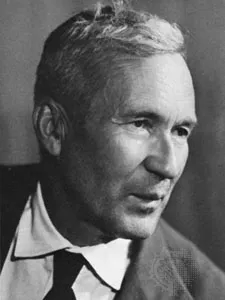
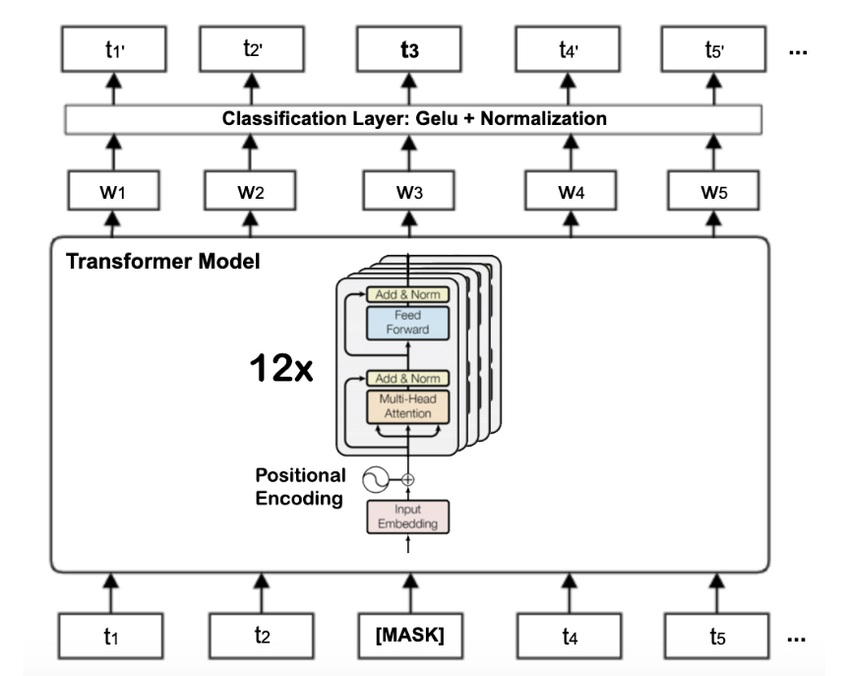
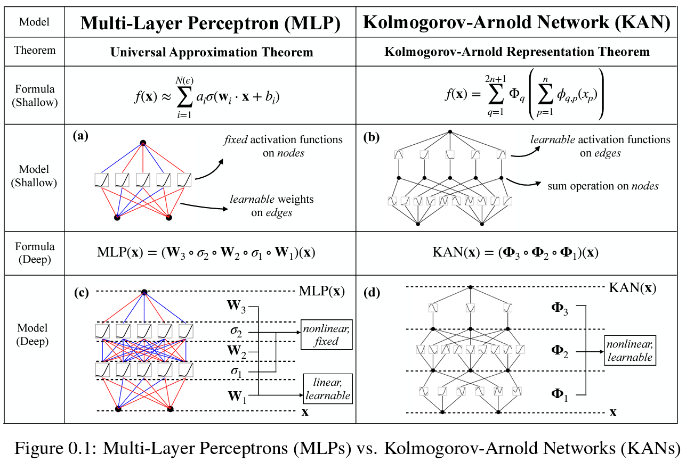

# KANBert

KANBert combines a transformer-based encoder only architecture with Kolmogorov-Arnold Networks (KANs) for an innovative approach to language understanding tasks.

    
    
    

## Transformer Encoders

Transformer encoders are relatively smaller models compared to their generative counterparts but are highly effective in performing language understanding tasks such as classification, named entity recognition, and embedding generation. The most popular transformer encoder is BERT, and the parameters here are inspired by this model.

    

    <b>Figure 1:</b> BERT Architecture [1]

## Kolmogorov-Arnold Networks (KAN)

Kolmogorov–Arnold Networks (KANs) are a new type of neural network that take a fundamentally different approach to learning compared to traditional MLPs. While MLPs use fixed activation functions at the nodes (or “neurons”), KANs place learnable univariate functions on the edges (or “weights”).

In KANs, each weight is replaced by a univariate function, typically parameterized as a spline. This allows the model to learn both the compositional structure of a problem and the optimal form of each transformation, often leading to compact and highly accurate models.

    

    <b>Figure 2:</b> KAN vs MLP [2]

## Project Architecture

| Name                        | Description                                                        |
|-----------------------------|--------------------------------------------------------------------|
| `model/`                    | Contains the main model files                                      |
| `model/kanbert.py`          | Implementation of the KANBert model                                |
| `utils/`                    | Utility files for the project                                      |
| `utils/encoder.py`          | Implementation of the Encoder layer                                |
| `utils/multiheadattention.py`| Implementation of the Multi Head Attention with KAN layers                     |
| `utils/positionwise.py`     | Implementation of the Position wise Feed Forward with KAN layers                |
| `utils/rope.py`             | Implementation of the RoPE for positional encoding                             |
| `utils/config.py`           | Configuration file for the inputs HP of the KANBert model                           |
| `model_tests/`              | Contains the test files for the project                            |
| `model_tests/kanbert_test.py`| Unit tests for the KANBert model                                  |
| `model_tests/utils_tests/`  | Contains the test files for the utility components                 |
| `model_tests/utils_tests/encoder_test.py`| Unit tests for the Encoder layer                    |
| `model_tests/utils_tests/multiheadattention_test.py`| Unit tests for the Multi Head Attention |
| `model_tests/utils_tests/positionwise_test.py`| Unit tests for the Position wise Feed Forward layer|
| `model_tests/utils_tests/rope_test.py`| Unit tests for the RoPE                           |

## Testing

The code has been thoroughly tested, and the tests are available and executed as GitHub Actions workflows. The code is also flake8 friendly.

### Sources

[1] ResearchGate, *The Transformer based BERT base architecture with twelve encoder blocks*, [https://www.researchgate.net/figure/The-Transformer-based-BERT-base-architecture-with-twelve-encoder-blocks_fig2_349546860](https://www.researchgate.net/figure/The-Transformer-based-BERT-base-architecture-with-twelve-encoder-blocks_fig2_349546860)

[2] Massachusetts Institute of Technology, *KAN: Kolmogorov–Arnold Networks*, [https://arxiv.org/abs/2404.19756](https://arxiv.org/abs/2404.19756)
