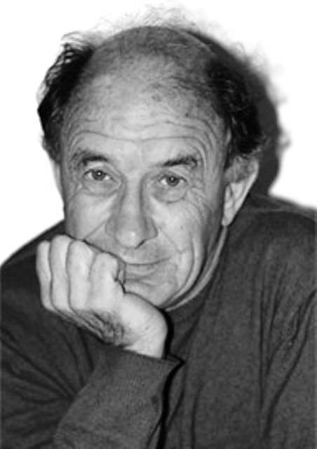
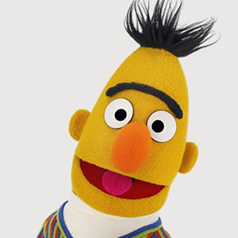

# KANBert

KANBert combines a transformer-based autoencoder architecture with Kolmogorov-Arnold Networks (KANs) for an innovative approach to language understanding tasks.

<p align="center">
    
    
    
</p>

## Transformer Auto-Encoders

Transformer auto-encoders are relatively smaller models compared to their generative counterparts but are highly effective in performing language understanding tasks such as classification, named entity recognition, and embedding generation. The most popular transformer auto-encoder is BERT, and the parameters here are inspired by this model.

<p align="center">
    
</p>

<p align="center">
    <b>Figure 1:</b> BERT Architecture [1]
</p>

## Kolmogorov-Arnold Networks (KAN)

Kolmogorov-Arnold Networks (KANs) are a new type of neural network that take a fundamentally different approach to learning compared to traditional MLPs. While MLPs have fixed activation functions on nodes (or “neurons”), KANs have learnable activation functions on edges (or “weights”). This simple change significantly enhances the network’s performance and interpretability.

In KANs, each weight parameter is replaced by a univariate function, typically parameterized as a spline. This architecture allows KANs to learn both the compositional structure of a problem and the optimal univariate functions, resulting in highly accurate models.

<p align="center">
    
</p>

<p align="center">
    <b>Figure 2:</b> KAN vs MLP [2]
</p>

## Project Architecture

| Name                        | Description                                                        |
|-----------------------------|--------------------------------------------------------------------|
| `model/`                    | Contains the main model files                                      |
| `model/kanbert.py`          | Implementation of the KANBert model                                |
| `utils/`                    | Utility files for the project                                      |
| `utils/encoder.py`          | Implementation of the Encoder layer                                |
| `utils/multiheadattention.py`| Implementation of the Multi Head Attention with KAN layers                     |
| `utils/positionwise.py`     | Implementation of the Position wise Feed Forward with KAN layers                |
| `utils/rope.py`             | Implementation of the RoPE for positional encoding                             |
| `utils/config.py`           | Configuration file for the inputs HP of the KANBert model                           |
| `model_tests/`              | Contains the test files for the project                            |
| `model_tests/kanbert_test.py`| Unit tests for the KANBert model                                  |
| `model_tests/utils_tests/`  | Contains the test files for the utility components                 |
| `model_tests/utils_tests/encoder_test.py`| Unit tests for the Encoder layer                    |
| `model_tests/utils_tests/multiheadattention_test.py`| Unit tests for the Multi Head Attention |
| `model_tests/utils_tests/positionwise_test.py`| Unit tests for the Position wise Feed Forward layer|
| `model_tests/utils_tests/rope_test.py`| Unit tests for the RoPE                           |

## Testing

The code has been thoroughly tested, and the tests are available and executed as GitHub Actions workflows. The code is also flake8 friendly.

```sh
# To run the tests locally
python -m unittest discover -s model_tests

# To check for PEP8 compliance with flake8
flake8 .
```

### Sources

[1] ResearchGate, *The Transformer based BERT base architecture with twelve encoder blocks*, [https://www.researchgate.net/figure/The-Transformer-based-BERT-base-architecture-with-twelve-encoder-blocks_fig2_349546860](https://www.researchgate.net/figure/The-Transformer-based-BERT-base-architecture-with-twelve-encoder-blocks_fig2_349546860)


[2] Massachusetts Institute of Technology, *KAN: Kolmogorov–Arnold Networks*, [https://arxiv.org/abs/2404.19756](https://arxiv.org/abs/2404.19756)
